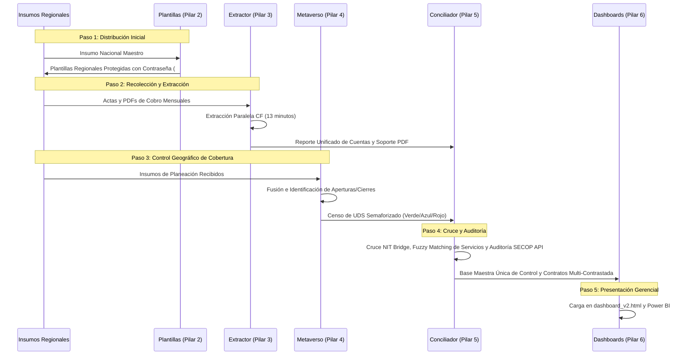

# 💼 SISTEMA DE CONTROL DE COSTOS Y AUDITORÍA (ICBF 2026)
## PANEL CENTRAL DE DOCUMENTACIÓN DE PROCESOS DE NEGOCIO

Este panel central unifica la documentación técnica y de negocio del proyecto **ICBF Cost-Tracking**. Hemos ordenado y marcado los pilares con sus **fechas de última modificación** para que identifiques de inmediato dónde se encuentra el foco más reciente y prioritario de desarrollo.

---

## 🎯 Objetivo Estratégico del Sistema
Automatizar la recolección, consolidación, auditoría cruzada y visualización de cupos y recursos de Primera Infancia del ICBF. El sistema integra bases de planeación de las **Regionales**, cobertura real (*Cuéntame*), contratos públicos (*SECOP I y II*), inventario físico de locales (*Metaverso*) y registros financieros (*Compromisos*), garantizando transparencia y previniendo sobrecostos o dobles pagos.

---

## 📅 Cronología del Foco de Desarrollo (Prioridades)
A continuación, se listan los pilares ordenados desde el **desarrollo más reciente y activo** (máxima prioridad de revisión) hasta los componentes de base histórica:

1.  **🚀 Pilar 2: Automatización y Distribución (Plantillas y Orquestador Piloto)**
    *   *Última Modificación*: **20 de Mayo de 2026** (Foco Activo)
    *   *Detalles*: Ajustes de última hora en el orquestador y automatizadores COM/Flexible para inyectar contraseñas y partir archivos regionales.
    *   👉 Documento: [docs/02_automatizacion_plantillas.md](file:///d:/ICBF/cost-tracking/docs/02_automatizacion_plantillas.md)
2.  **🔄 Pilar 1: Consolidación y Calidad Regional (Integrales y HCB)**
    *   *Última Modificación*: **06 de Mayo de 2026**
    *   *Detalles*: Refinamiento del pipeline de depuración de filas "TOTAL" y dobles conteos para la modalidad HCB.
    *   👉 Documento: [docs/01_consolidacion_regional.md](file:///d:/ICBF/cost-tracking/docs/01_consolidacion_regional.md)
3.  **📂 Pilar 3: Digitalización y Extracción de Actas Físicas (Cuentas)**
    *   *Última Modificación*: **06 de Mayo de 2026**
    *   *Detalles*: Actualización del orquestador Jupyter de actas y validación mensual de coincidencia contra soporte PDF.
    *   👉 Documento: [docs/03_extraccion_actas.md](file:///d:/ICBF/cost-tracking/docs/03_extraccion_actas.md)
4.  **🔗 Pilar 5: Conciliación Avanzada y Cruce Sincrónico (NIT Bridge y SECOP)**
    *   *Última Modificación*: **24 de Abril de 2026**
    *   *Detalles*: Implementación del cruce de similitud lingüística (Fuzzy Matching) y consultas API automáticas a SECOP I y II.
    *   👉 Documento: [docs/05_cruce_secop_nit_bridge.md](file:///d:/ICBF/cost-tracking/docs/05_cruce_secop_nit_bridge.md)
5.  **🗺️ Pilar 4: Reconstrucción del Censo Nacional (Metaverso UDS)**
    *   *Última Modificación*: **23 de Abril de 2026**
    *   *Detalles*: Generación nacional del consolidado de sedes físicas activas e inactivas (Semaforización).
    *   👉 Documento: [docs/04_censo_metaverso.md](file:///d:/ICBF/cost-tracking/docs/04_censo_metaverso.md)
6.  **📈 Pilar 6: Visualización Gerencial e Inteligencia de Negocios**
    *   *Última Modificación*: **Abril - Mayo de 2026**
    *   *Detalles*: Maquetación del dashboard web en Glassmorphic UI y tableros corporativos de Power BI.
    *   👉 Documento: [docs/06_dashboards_visualizacion.md](file:///d:/ICBF/cost-tracking/docs/06_dashboards_visualizacion.md)

---

## 📂 Acceso Directo de Apertura Rápida (IDE / File System)
*   📖 Pilar 1: [Consolidación y Calidad Regional (06 de Mayo de 2026)](file:///d:/ICBF/cost-tracking/docs/01_consolidacion_regional.md)
*   🔑 Pilar 2: [Plantillas y Distribución (20 de Mayo de 2026)](file:///d:/ICBF/cost-tracking/docs/02_automatizacion_plantillas.md)
*   📄 Pilar 3: [Digitalización y Extracción de Actas (06 de Mayo de 2026)](file:///d:/ICBF/cost-tracking/docs/03_extraccion_actas.md)
*   🗺️ Pilar 4: [Reconstrucción e Integridad de UDS (23 de Abril de 2026)](file:///d:/ICBF/cost-tracking/docs/04_censo_metaverso.md)
*   🔀 Pilar 5: [Conciliación, NIT Bridge y SECOP (24 de Abril de 2026)](file:///d:/ICBF/cost-tracking/docs/05_cruce_secop_nit_bridge.md)
*   📊 Pilar 6: [Dashboards y BI Ejecutivos (Abril - Mayo de 2026)](file:///d:/ICBF/cost-tracking/docs/06_dashboards_visualizacion.md)

### 📘 Documentación Complementaria (Nuevos Documentos)
*   🔧 Pilar 4 Detallado: [Pipeline Metaverso (todos los scripts paso a paso)](file:///d:/ICBF/cost-tracking/docs/07_pipeline_metaverso_detallado.md)
*   📂 Split + Monitoreo: [División HCB por Regional y Sistema de Calidad](file:///d:/ICBF/cost-tracking/docs/08_split_hcb_monitoreo.md)
*   🤖 Automatización Piloto: [Scripts detallados de generación de plantillas](file:///d:/ICBF/cost-tracking/docs/09_automatizacion_piloto_detallada.md)
*   🐳 Infraestructura: [Docker, DevContainer, make.bat y pyproject.toml](file:///d:/ICBF/cost-tracking/docs/10_infraestructura_docker.md)
*   📁 Datos: [Estructura y contenido de data/ y bi/](file:///d:/ICBF/cost-tracking/docs/11_estructura_datos.md)
*   🛠️ Utilitarios: [Scripts auxiliares, notebooks y utilidades](file:///d:/ICBF/cost-tracking/docs/12_scripts_utilitarios.md)

---

## 🔀 Flujo de Ejecución Mensual (Paso a Paso)

Para actualizar el sistema mensualmente o preparar la sustentación periódica, ejecute las fases del proyecto en la siguiente secuencia cronológica:

---

## 💡 Conceptos Clave de Negocio (Resumen)

*   **NIT Bridge (Puente de Datos)**: Vincula contratos de diferentes vigencias (2025 y 2026) traduciendo códigos temporales hacia el **NIT de la EAS (Contratista)** a través de la base Cuéntame. Permite que bases históricas y de planeación se reconcilien bajo una misma llave.
*   **Fuzzy Matching (Búsqueda Difusa)**: Mapea nombres de servicios que presentan discrepancias tipográficas (Ej: `"CENTRO DESARROLLO INFANTIL"` vs `"CDI"`) calculando la similitud Levenshtein. Si supera el 85%, el sistema los empareja y los asigna automáticamente al slot correcto del Excel consolidado.
*   **Filtro de Primera Ocurrencia**: Para evitar duplicar montos financieros al cruzar un solo contrato con múltiples UDS asociadas, escribe el costo del contrato únicamente en la primera fila de la coincidencia y deja las celdas restantes vacías. Excel puede sumar la columna de costos de forma correcta sin distorsionar el consolidado.

---

## 📊 Recomendaciones de Gobernanza
Para el éxito del sistema en sustentaciones futuras, se sugiere implementar:
1.  **Catálogo Único**: Crear una tabla maestra de nombres de servicios obligatoria y cerrada.
2.  **Llave Primaria Obligatoria**: Exigir que todo documento de planeación regional incluya el NIT del operador.
3.  **Nomenclatura Estricta de PDFs**: Estandarizar la sintaxis de carga de actas firmadas (Ej. `NIT_CONTRATO_MES.pdf`).
